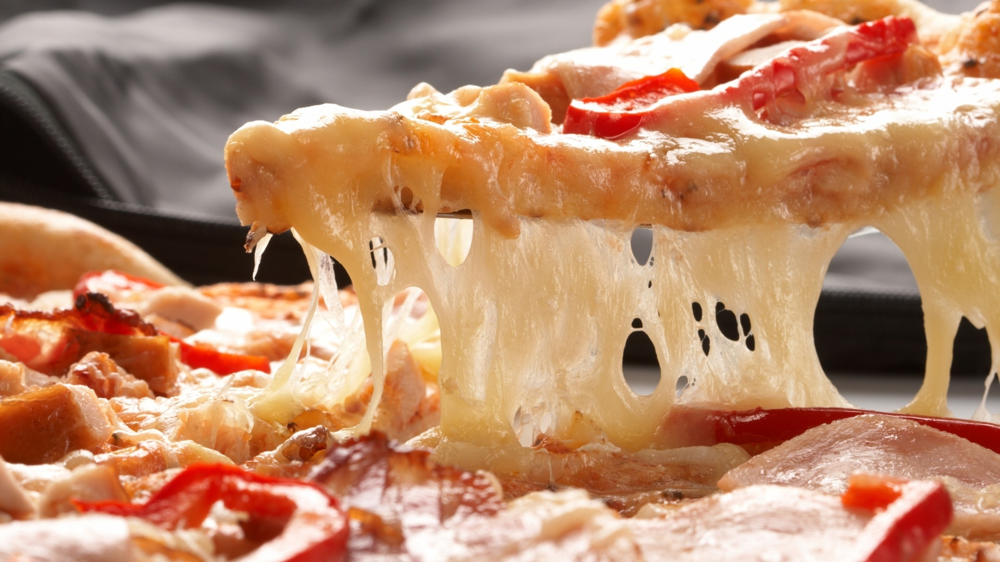

# 4ip.project
 
 
  ##  PIZZA PARLOR

  PIZZA PARLOR As a restaurant, pizza maker and caring company, Pizza delivers.  
We provide a flavourful, varied and high-quality menu to pizza-lovers of all ages 
 and tastes. As a result, our organization has become a leader in the quick service.  

#  IRAHOZA Denyse

## Description
#### about us
We work as team with you and to make sure that you have got pizza you want with good wanted topping ,crust ,size , number,flavours. 
We respect time and we mantain good and high quality of what we do.
Then we provide needed services the customer is a King.customer care is our first priority.
#### services we offer
##### restaurant
We provide pizza with all good quality and visual design and user experience testing. Throughout your order, our designers and cookers create and implement visual designs where user provide feedback from the starting antil the end and work with you to make sure what gets is what is needed.
##### pizza makerand caring company
We have good employees  who have experience in pizza making  and delivaring technologies. They collaborate with your to provide needed services.
##### pizza delivers
Ordering is the first. Because we are constantly working for mantaining the quality and even improve the quality.This process allows for changes as customer requirements increases.
 ## Setup/Installation Requirements
 
   * Personal computer
   * Visual Studio Code
   * Browser(Chrome is advisable)
   
## BDD(Bihavior Driven DEVELOPMENT)
Requirement include form which show type of pizza he want,alert telling user that you are going to give him service.
 Get this user input and even use jquery to get the user input.
 Display what he has ordered.
## Technologies Used
* html
* css(styles.css and bootstrap)
* jquery
* javascripts

## link for this project
<link file:///home/wecode/Documents/moringa-school-projects/4ip-project/index.html#home>

 ## Support and contact details
#### contact us
* tel:0783260920
* email: irahodeny1@gmail.com
* instagram: irahoza denyse
* facebook: irahoza denyse
### License

Copyright (c) {2019} **{ IRAHOZA Denyse}** 

